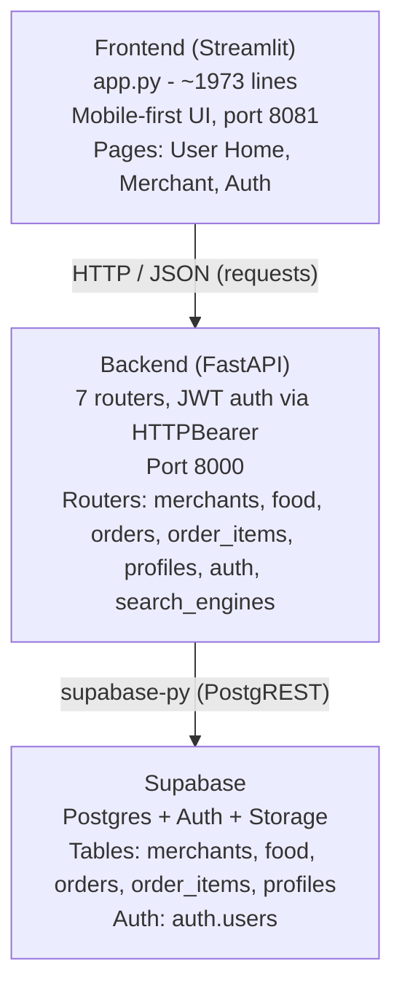
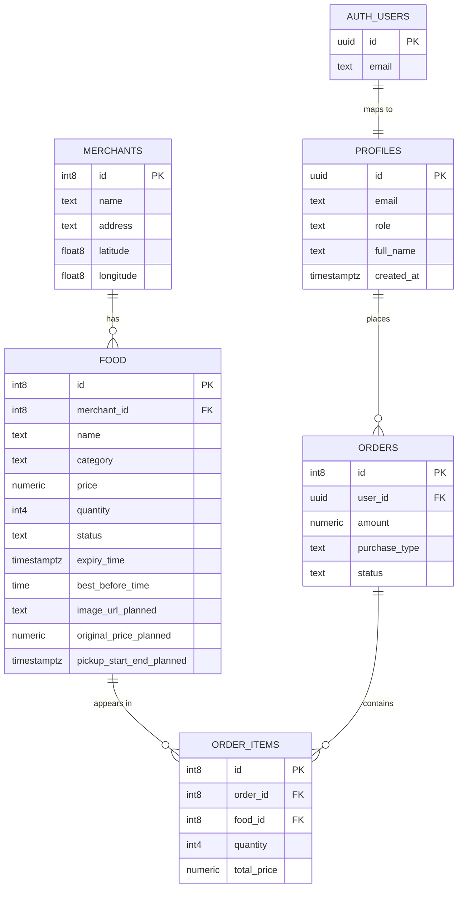
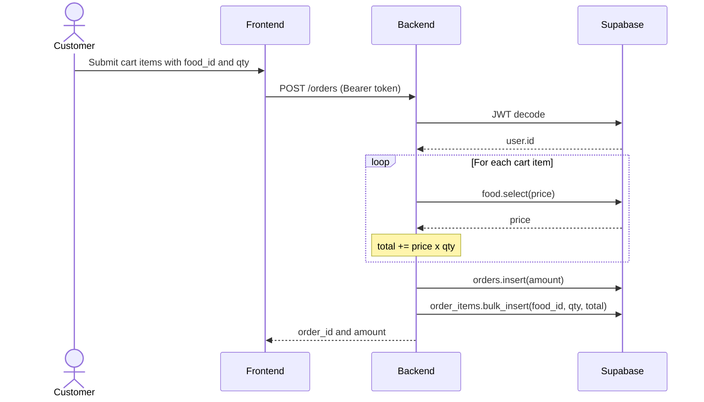
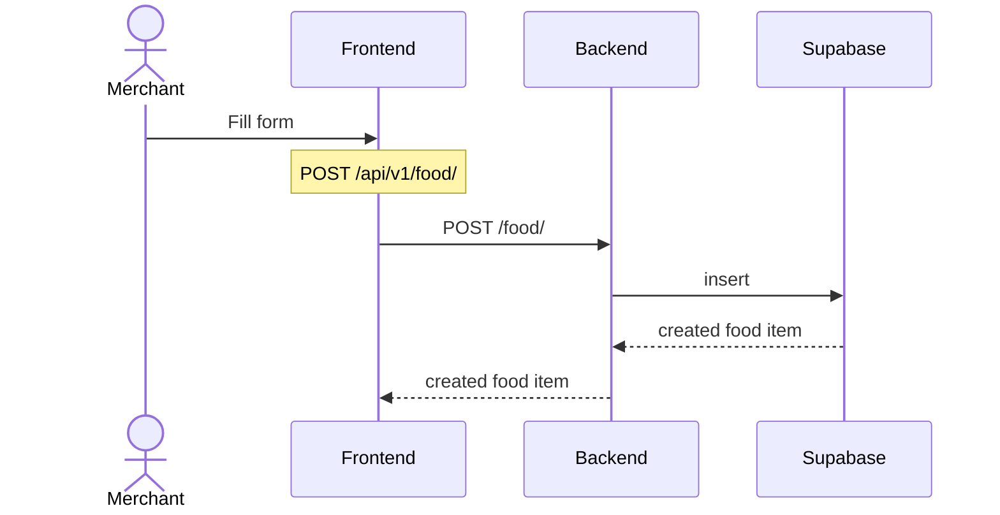
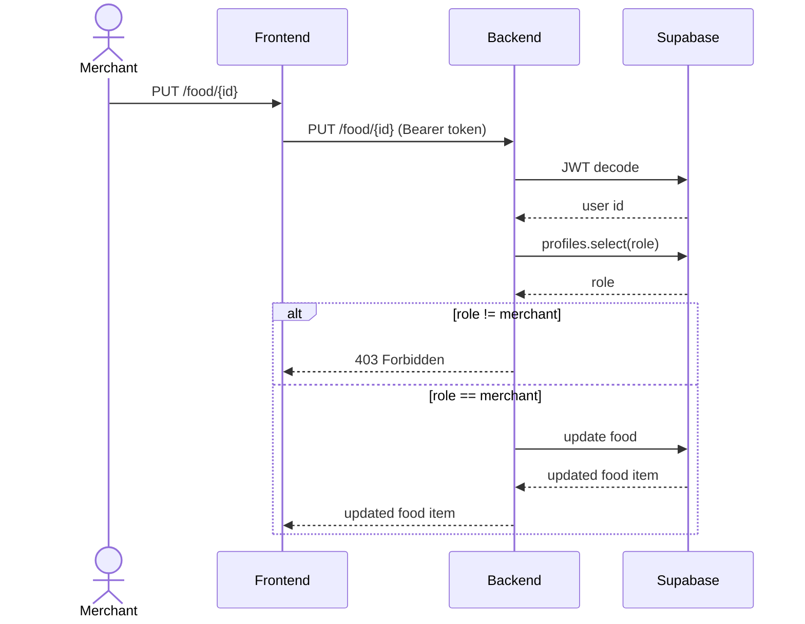
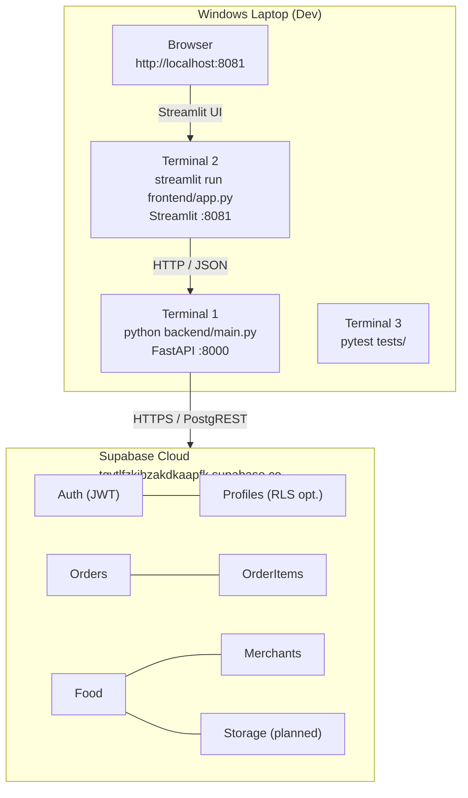

# LoopBite — System Architecture

> Documentation for **LoopBite** (project name: FamilyMart Rescue) — a platform helping merchants sell soon-to-expire food quickly, reducing waste.

*Updated: 2026-06-28 — reflects codebase after `git pull origin main`*

---

## 1. System Overview



---

## 2. Actors & Use Cases

### 2.1 Actors
| Actor | `role` in profiles | Description |
|---|---|---|
| **Merchant** | `role = "merchant"` | Store owner, posts rescue items, manages orders |
| **Customer** | `role = "customer"` (default) | Finds items, places orders |
| **Admin** | Via `DELETE /api/v1/auth/delete-user/{id}` | Operations |

### 2.2 Use Cases
| ID | Use Case | Actor |
|---|---|---|
| UC-1 | Register new account | Customer / Merchant |
| UC-2 | Login → receive JWT access_token | Customer / Merchant |
| UC-3 | View current profile | Customer / Merchant |
| UC-4 | Merchant posts rescue food item | Merchant |
| UC-5 | Merchant updates / deletes food | Merchant |
| UC-6 | Customer searches by keyword + location | Customer |
| UC-7 | Customer places order (multi-item cart) | Customer |
| UC-8 | View order list | Customer / Merchant |

---

## 3. Frontend Architecture (Streamlit)

### 3.1 Tech Stack
- **Framework:** Streamlit (Python) — `streamlit run frontend/app.py`
- **HTTP client:** `api_client.py` (requests wrapper)
- **Caching:** `@st.cache_data(ttl=30)`
- **Styling:** Custom CSS inline (mobile-first, max-width 480px)
- **Map:** pydeck (optional, graceful fallback)

### 3.2 Directory Structure
```
frontend/
├── app.py              # ~1973 lines, main entry point
├── api_client.py       # HTTP wrapper for FastAPI
├── requirements.txt
└── (assets)
```

### 3.3 Pages / Routes
Frontend uses `st.session_state` for SPA-style routing (no Streamlit multi-page):

| Page (`st.session_state.page`) | Function |
|---|---|
| `"home"` | User Home — find nearby rescue food |
| `"merchant"` | Merchant Dashboard — post items, manage inventory |
| `"login"` | Login → receive token → store in `st.session_state.token` |
| `"register"` | Register new account |

### 3.4 Auth State (Frontend)
```
st.session_state.token  # JWT access_token after login
st.session_state.user   # { id, email } after login
st.session_state.page   # current route
```

### 3.5 Cache Strategy
```python
@st.cache_data(ttl=30, show_spinner=False)
def _cached_food(merchant_id: int):
    return api.list_food(merchant_id=merchant_id)

@st.cache_data(ttl=30, show_spinner=False)
def _cached_merchants():
    return api.list_merchants()
```
- TTL 30s — balance between freshness and API call reduction
- Cache invalidated on POST / PUT / DELETE actions

---

## 4. Backend Architecture (FastAPI)

### 4.1 Tech Stack
- **Framework:** FastAPI + Uvicorn (`uvicorn main:app`, host=127.0.0.1, port=8000)
- **Validation:** Pydantic v2
- **DB client:** `supabase-py` (PostgREST)
- **Auth:** Supabase Auth (JWT access_token) + HTTPBearer
- **Middleware:** CORS (allows localhost:3000/8000/8080/8081 + `*`)
- **Lifespan:** checks Supabase connection on startup

### 4.2 Directory Structure
```
backend/
├── main.py                    # uvicorn entry point
├── app.py                     # FastAPI factory + lifespan + CORS
├── .env                       # SUPABASE_URL, SUPABASE_KEY
├── database/
│   └── __init__.py            # Supabase client singleton
├── middlewares/
│   └── cors.py                # CORS middleware
├── models/
│   ├── __init__.py            # Re-exports: Merchants, Profiles, Food,
│   │                          #   FoodUpdate, Orders, OrderItems,
│   │                          #   UserRegister, UserLogin, ProfileUpdate
│   ├── merchants.py           # Merchants Pydantic model
│   ├── profiles.py            # Profiles, UserRegister, UserLogin,
│   │                          #   ProfileUpdate
│   ├── food.py                # Food, FoodUpdate (+ best_before_time)
│   ├── orders.py              # Orders, CartItemInput, OrderCreateRequest
│   └── order_items.py         # OrderItems
└── routers/
    ├── __init__.py            # api_router — includes all 7 routers
    ├── merchant_router.py      # /api/v1/merchants/*
    ├── food_router.py          # /api/v1/food/*  [JWT required: PUT, DELETE]
    ├── order_router.py         # /api/v1/orders/* [JWT required: POST]
    ├── order_item_router.py    # /api/v1/order-items/*
    ├── profile_router.py       # /api/v1/profiles/*
    ├── auth_router.py          # /api/v1/auth/*
    └── search_engines.py       # /api/v1/search/foods
```

### 4.3 REST API Surface

#### Auth — `/api/v1/auth`
| Method | Path | Auth | Description |
|---|---|---|---|
| `POST` | `/register` | None | Register → Supabase Auth + DB trigger creates profile |
| `POST` | `/login` | None | Login → returns `access_token` JWT |
| `GET` | `/me` | Bearer token | Get current user info |
| `DELETE` | `/delete-user/{user_id}` | None | Admin deletes user + cascades to profiles |

#### Profiles — `/api/v1/profiles`
| Method | Path | Auth | Description |
|---|---|---|---|
| `GET` | `/` | None | List all profiles |
| `PUT` | `/{profile_id}` | None | Update `full_name` / `role` |

#### Merchants — `/api/v1/merchants`
| Method | Path | Auth | Description |
|---|---|---|---|
| `GET` | `/` | None | List all merchants |
| `GET` | `/{merchant_id}` | None | Get merchant by ID |
| `GET` | `/merchant_food/{merchant_id}` | None | List merchant's food (sorted by ID asc) |
| `POST` | `/` | None | Create merchant |
| `PUT` | `/{merchant_id}` | None | Update merchant |
| `DELETE` | `/{merchant_id}` | None | Delete merchant |

#### Food — `/api/v1/food`
| Method | Path | Auth | Description |
|---|---|---|---|
| `GET` | `/` | None | List all food (sorted by ID asc) |
| `GET` | `/{food_id}` | None | Get food by ID |
| `POST` | `/` | None | Create food item (merchant_id=0 → random 2–71) |
| `PUT` | `/{food_id}` | **Bearer (merchant only)** | Update price / quantity |
| `DELETE` | `/{food_id}` | **Bearer (merchant only)** | Delete food item |

> **RBAC:** `verify_merchant_role()` decodes JWT → checks `profiles.role == "merchant"`. Returns HTTP 403 if not a merchant.

#### Orders — `/api/v1/orders`
| Method | Path | Auth | Description |
|---|---|---|---|
| `GET` | `/` | None | List all orders |
| `GET` | `/{order_id}` | None | Get order by ID |
| `POST` | `/` | **Bearer token** | Create order from cart (multi-item) |
| `DELETE` | `/{order_id}` | None | Delete order |

**POST /orders body:**
```json
{
  "purchase_type": "delivery",
  "items": [
    { "food_id": 1, "quantity": 2 },
    { "food_id": 3, "quantity": 1 }
  ]
}
```
Server calculates `total_amount` from DB (prevents client-side price tampering), creates one `orders` row + multiple `order_items` rows.

#### Order Items — `/api/v1/order-items`
| Method | Path | Auth | Description |
|---|---|---|---|
| `GET` | `/` | None | List all order items |
| `POST` | `/` | None | Create one order item |
| `DELETE` | `/{item_id}` | None | Delete order item |

#### Search — `/api/v1/search/foods`
| Method | Path | Auth | Description |
|---|---|---|---|
| `GET` | `/foods?keyword=...&user_lat=...&user_lng=...` | None | Find nearby food by keyword |

Logic:
1. Get top 10 nearest merchants (Haversine formula)
2. Fetch food for those merchants
3. Filter: keyword match (Vietnamese normalization, remove diacritics) + `quantity > 0` + `status != inactive`
4. Return: `[{ merchant, foods }]`

---

## 5. Data Model (Supabase / Postgres)

### 5.1 ER Diagram



### 5.2 Table: `merchants`
| Column | Type | Notes |
|---|---|---|
| `id` | int8, PK | auto-increment |
| `name` | text | required |
| `address` | text | optional |
| `latitude` | float8 | optional |
| `longitude` | float8 | optional |

### 5.3 Table: `food`
| Column | Type | Notes |
|---|---|---|
| `id` | int8, PK | auto-increment |
| `merchant_id` | int8, FK → merchants.id | |
| `name` | text | required |
| `category` | text | "Onigiri", "Bento", … |
| `price` | numeric | rescue price |
| `quantity` | int4 | remaining quantity |
| `status` | text | `available` / `sold_out` / `inactive` |
| `expiry_time` | timestamptz | best before timestamp |
| `best_before_time` | time | recommended pickup time |
| *(planned)* `image_url` | text | Supabase Storage URL |
| *(planned)* `original_price` | numeric | original price before discount |
| *(planned)* `pickup_start/end` | timestamptz | pickup time window |

### 5.4 Table: `orders`
| Column | Type | Notes |
|---|---|---|
| `id` | int8, PK | auto-increment |
| `user_id` | uuid, FK → profiles.id | buyer |
| `amount` | numeric | total (server-calculated) |
| `purchase_type` | text | `delivery` / `takeaway` / `rescue` |
| `status` | text | `pending` / `picked_up` / `cancelled` |

### 5.5 Table: `order_items`
| Column | Type | Notes |
|---|---|---|
| `id` | int8, PK | auto-increment |
| `order_id` | int8, FK → orders.id | |
| `food_id` | int8, FK → food.id | |
| `quantity` | int4 | |
| `total_price` | numeric | price × quantity (server-calculated) |

### 5.6 Table: `profiles`
| Column | Type | Notes |
|---|---|---|
| `id` | uuid, PK (= auth.users.id) | linked via Supabase trigger |
| `email` | EmailStr | |
| `role` | text | `customer` (default) / `merchant` |
| `full_name` | text | |
| `created_at` | timestamptz | |

---

## 6. Data Flows

### 6.1 Authentication Flow

```mermaid
sequenceDiagram
    actor User
    participant Frontend
    participant Backend
    participant Supabase

    User->>Frontend: Register
    Frontend->>Backend: POST /auth/register
    Backend->>Supabase: sign_up
    Note over Backend,Supabase: DB trigger inserts profiles.id = auth.uid
    Supabase-->>Backend: Sign-up result
    Backend-->>Frontend: Check email
    Frontend-->>User: Check email

    User->>Frontend: Login
    Frontend->>Backend: POST /auth/login
    Backend->>Supabase: sign_in_with_password
    Supabase-->>Backend: access_token (JWT)
    Backend-->>Frontend: access_token and profile data
    Note over Frontend: Store token in st.session_state.token

    Frontend->>Backend: GET /auth/me
    Backend->>Supabase: get_user(token)
    Supabase-->>Backend: user.id
    Backend->>Supabase: profiles.select(id)
    Supabase-->>Backend: profile
    Backend-->>Frontend: auth_id and profile
```


### 6.2 Order Creation Flow (Server-Side Price Protection)


### 6.3 Merchant Creates Food Item


### 6.4 Merchant Updates Food (with Role Check)


---

## 7. Business Rules

| ID | Rule | Status |
|---|---|---|
| BR-1 | Item shown when: `status='available' AND quantity > 0` | ✅ |
| BR-2 | When `quantity == 0` → `status = 'sold_out'` | ✅ (frontend filter) |
| BR-3 | Rescue price ≤ original price | 🟡 (`original_price` field not yet added) |
| BR-4 | Server calculates `total_amount` from DB (no client-side price) | ✅ |
| BR-5 | Only merchants can PUT / DELETE food | ✅ (`verify_merchant_role`) |
| BR-6 | Order with multiple items (cart multi-item) | ✅ |
| BR-7 | 6-char pickup code when receiving order | 🔴 Not yet implemented |

---

## 8. ⚠️ Bugs & Missing Items

### Bugs to Fix Immediately

**`routers/__init__.py` — food_router registered twice:**
```python
api_router.include_router(food_router)   # line 14 ✅
# ...
api_router.include_router(food_router)   # line 20 ❌ DUPLICATE
```

**`models/__init__.py` — missing exports:**
```python
# Currently missing — add these imports:
from .orders import OrderCreateRequest, CartItemInput
from .profiles import UserRegister, UserLogin, ProfileUpdate
```

---

## 9. Testing

See `tests/README.md` for details. Test structure:

| Layer | File | Type |
|---|---|---|
| Unit | `test_models.py` | Pydantic schema validation |
| API | `test_merchants_api.py`, `test_food_api.py` | FastAPI TestClient + Supabase |
| Frontend | `test_frontend_smoke.py` | `api_client` helpers + live API |
| E2E | `test_e2e_demo_flow.py` | Demo flow for merchant |
| Runner | `run_all_tests.py` | Runs all tests |

---

## 10. Deployment (Physical)



---

## 11. Key Design Decisions

| # | Decision | Reason |
|---|---|---|
| 1 | JWT via Supabase Auth instead of custom auth | Fast setup, built-in, high security |
| 2 | `total_amount` calculated on server | Prevents client-side price tampering |
| 3 | Multi-item cart (multiple `order_items` rows) | More realistic than one-item-per-order |
| 4 | `verify_merchant_role()` helper | Simple RBAC, token decoded once |
| 5 | Streamlit for MVP | Fast development, built-in UI |
| 6 | Haversine + top-10 merchants | Sufficient for MVP, scales to PostGIS later |
| 7 | `best_before_time` is `time` (not `datetime`) | Spec says "start/end hours for pickup" |

---

## 12. Backlog

### 🔴 High (MVP completion)
- [ ] Fix `routers/__init__.py` — remove duplicate food_router
- [ ] Add missing exports to `models/__init__.py` (`OrderCreateRequest`, `CartItemInput`, `UserRegister`, `UserLogin`, `ProfileUpdate`)
- [ ] Implement **pickup code** flow: `POST /orders/{id}/confirm-pickup` → update `orders.status`, decrement `food.quantity`

### 🟡 Medium (UX improvements)
- [ ] Add `original_price`, `pickup_start`, `pickup_end`, `quality_note`, `image_url` to food model
- [ ] Frontend "Orders" page — list orders + confirm pickup
- [ ] RLS (Row Level Security) on Supabase — merchant sees only their own orders
- [ ] Frontend merchant filter — show only food belonging to logged-in merchant

### 🟢 Low (production readiness)
- [ ] Push notifications for new orders
- [ ] Supabase Realtime subscription for dashboard updates
- [ ] Payment integration: VNPay / MoMo / ZaloPay
- [ ] Image upload → Supabase Storage
- [ ] Docker Compose for dev environment
- [ ] GitHub Actions CI/CD running pytest
- [ ] PostGIS instead of Haversine for scaled geo search

---

*This document reflects the codebase after `git pull origin main` on 2026-06-28.*
